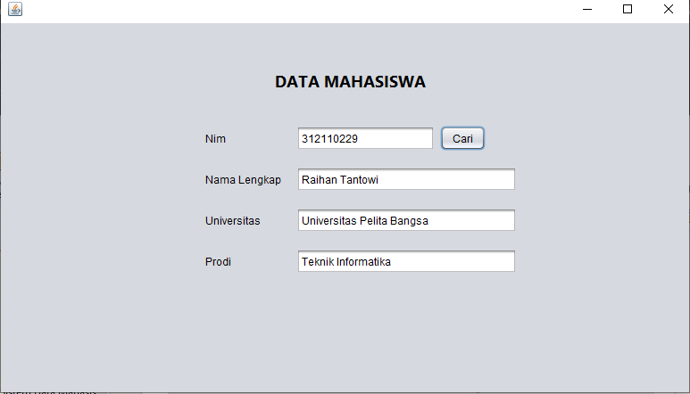

# UAS OOP SMT 3

```sh
Nama   : Raihan Tantowi
Nim    : 312110229
Matkul : Pemrograman Orientasi Objek
```
### Berikut adalah diagram class yang dibuat :


#### 1.) Link dokumentasi pdf
[ Dokumentasi pdf ](https://drive.google.com/file/d/1jMivoFcn7UN4M3MCcPgXMZKjSce0DLZ_/view?usp=sharing)

#### 2.) Link penjelasan yt
[ Penjelasan yt ](https://youtu.be/4a3MaLOOywg)

#### 3.) Kode program yang dibuat
[ Kode java ](src/DataMahasiswa)

#### Hasil gui 



